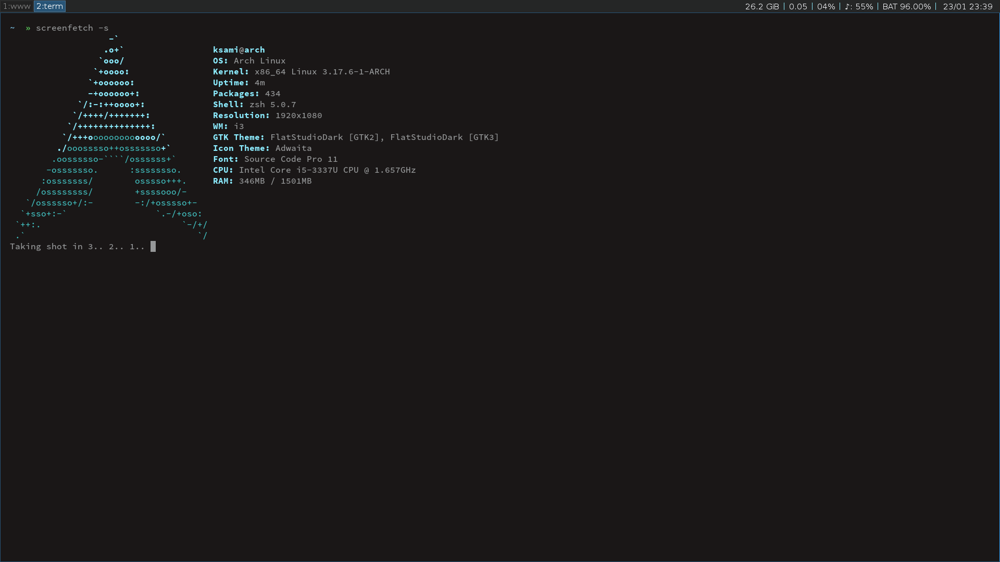
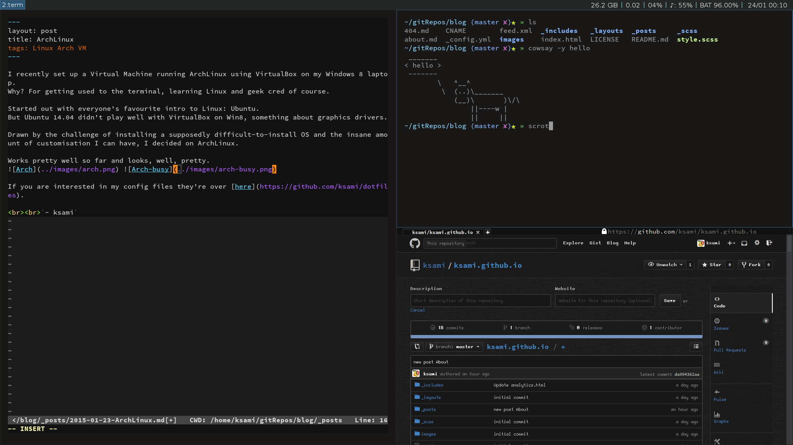

I recently set up a Virtual Machine running ArchLinux using VirtualBox on my Windows 8 laptop.
Why? For getting used to the terminal, learning Linux and geek cred of course.

Setting up a VM to experiment with different OS(es?) made the most sense since there's no fear of screwing up your computer and cleaning up is as simple as deleting the hard drive file that was used.

Started out with everyone's favourite intro to Linux: Ubuntu.
But Ubuntu 14.04 didn't play well with VirtualBox on Win8, something about graphics drivers.

Drawn by the challenge of installing a supposedly difficult-to-install OS and the insane amount of customisation I can have, I decided on ArchLinux.

Works pretty well so far and looks, well, pretty.

 

If you are interested in my config files they're over [here](https://github.com/ksami/dotfiles).  
The guide I followed is [here](http://dwheelerau.com/2014/07/25/install-arch-linux-on-virtualbox-the-nuts-and-bolts-pt1/).

  `- ksami`
