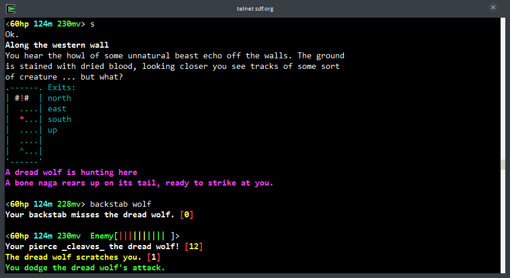

I've always wanted to build a game much like games I've played before, eg. Neopets (I was 9 years old okay!), Runescape, Maplestory, Granado Espada, Dragonnest etc. Spot the trend? Yup, they are all massively multiplayer role-playing games (MMORPG). I liked the concept of having an alternate persona, braver, cooler and more adventurous than me; perhaps due to my shyness, social awkwardness and general lack of fitness. MMORPGs were a great place to be all that, and more! With Dragonnest, I hit jackpot when I discovered how easy it was to mod the game; albeit applying client-side visual and audio mods.

However, I'm no artist and that was the main factor holding me back from creating such games. What's an MMORPG without graphics? At least that's what I thought.

Then, during university, I got more familiar with the *nix command-line and discovered the ancestor of MMORPGs, the [multi-user dungeon (MUD)](http://en.wikipedia.org/wiki/MUD). A large number of them were text-based since during the early days there were no graphics. Some of them still survive to this day, having run for over 15 years! I was introduced to a world of games without graphics, no less exciting than MMORPGs.

  
SDF MUD running via telnet in Cygwin

I excitedly started building a MUD in NodeJS using socket.io for real-time communication, without any other framework or library or even a database (everything was stupidly stored in a bunch of JSON files). The codebase soon got too large and messy for me to handle or even begin to refactor. I managed to build it up to the point where combat, items and equipping were possible though; and of course chatting with other players. It is still live at [muddy-ksami.rhcloud.com](http://muddy-ksami.rhcloud.com) though bugs crash it every now and then.

After neglecting the project for half a year thanks to the busiest semester in school yet, I've started rebuilding the codebase from scratch. This time, I'm using MeteorJS which has databases, templates and real-time reactivity built-in; not forgetting a whole bunch of packages to choose from. If you miss `npm` packages, they're also include-able using the [meteorhacks:npm](https://atmospherejs.com/meteorhacks/npm) Meteor package.

For MuddyV2, I've added [lepozepo:streams](https://atmospherejs.com/lepozepo/streams) for socket.io-like DB-less communication and [brentjanderson:kinetic](https://atmospherejs.com/brentjanderson/kinetic) for sprite animation and manipulation. Yes, for the rewritten MuddyV2, there will be graphics, pixel art but nonetheless, graphics (pixel art post for another day).

I will try my best to document things I've learned on this journey to building a MUD; all posts will be tagged with muddy for tracking my progress for both you and me. Hopefully these will at least be slightly useful to someone someday.