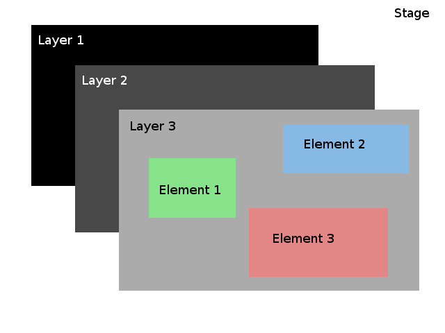

I've been having a bit of difficulty understanding the [KineticJS] framework so I thought I should just document what I've understood so far and provide a starting point for anyone else trying to learn KineticJS. I won't go into the details, those can be found with a bit of Google-fu; I will instead take a high-level look at KineticJS.

Firstly though, note that KineticJS is no longer being maintained as stated on their website. It however appears to be quite popular and as such many answers/tutorials can be found eg. on [StackOverflow]. 

Documentation for KineticJS has also been mirrored over at [AgaveStorm].

### Structure
The structure of KineticJS is actually quite logical and easy to visualise. There is the Stage, Layers, and Images, Sprites, Shapes which I will group under Elements.

  
<span class="caption">Layers</span>

#### Stage
The stage is the container holding all these layers. Layers have to be explicitly added to the stage using `stage.add(layer)`.

It is rendered in HTML as a `<div>` element with a class of `kineticjs-content`.

#### Layers
Layers hold one or more elements and have the following properties:  
1. Stacking on top of one another
2. Grouping elements on the same layer
3. Changes affecting one layer do not affect the other layers

Property 1 is useful in cases such as having a character on top of a background. The background would logically be underneath the character and not covering the character.

Property 2 means that changes which target the layer affect all the elements on that layer. For example, moving the layer towards the right would also move all elements on that layer.

Property 3 could be said to be implied from Property 2 but I feel that it should be highlighted. Any changes made to say, layer 1, would not affect layer 2. I don't know how else I can elaborate this.

Layers are rendered in HTML as `<canvas>` elements, each layer a separate `<canvas>`.

#### Elements
So far, I've used the Image, Sprite, Line and Rect elements which create an element of its namesake. Sprites are especially useful if you already have frames of an animation and want to quickly animate it. Other elements can be found in the documentation from [AgaveStorm] and shall be left as an exercise for the reader to discover them.

### Some things to note  
1. If things aren't even beginning to appear
  - Check that elements have been added to the layer `layer.add(element)`, layer to the stage `stage.add(layer)`
  - Reconfirm which layer is above which; layers can be moved up or down using `layer.moveUp()` `layer.moveToBottom()` etc.
  - Make sure `layer.draw()` is called at least once after adding all the elements to it
  - Check that the `src` of images and sprites have been correctly declared `image.src = "/image.png"`
2. Remember to start your sprite animation with `sprite.start()`
3. To create a `Kinetic.Line()`, pass an object into it with the following properties

  ```javascript
  var line = new Kinetic.Line({
    x: origin.x,  // x-coordinate of origin (point to start from)
    y: origin.y,  // y-coordinate of origin (point to start from)
    points: [
      x1, y1,  // Draws a line to this offset from origin
      x2, y2   // Draws another line to this offset
      //...
    ]
    //other properties
  });
  ```


[KineticJS]: http://kineticjs.com/
[StackOverflow]: https://stackoverflow.com/
[AgaveStorm]: http://agavestorm.com/kineticjs/index.html