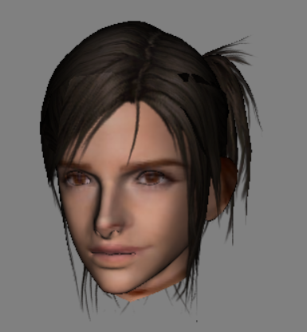

The semester is finally over and you can finally read my exciting updates once again! (대박 my last post was in April...)

Side note: I've been meaning to get on with a redesign of the site but design hasn't been one of my strong points recently. If you have any suggestions, you're welcome to leave them in the comments box or open an issue on the [github repo](https://github.com/ksami/ksami.github.io/issues). If you send code, you can use a [pull request](https://github.com/ksami/ksami.github.io/pulls); accepted ones get a cookie*!

*No guarantees on the reality of the cookie

---

It has been a really tough semester in SNU, what with 4 com science classes, 2 at 3rd year level, 2 at final year level, with 1 from each being taught in Korean >< But it's finally all over so no use worrying about grades and all that, what will happen will happen. I did learn some interesting topics that will probably help me in the future. I won't do a module review though, an exchange student has different circumstances from a regular student.

 

In Image Processing, my group created an application to help with visualising hairstyles, the premise being people having a hard time communicating how they want their hair to be styled.

The idea is: you *very conveniently* take a picture with any camera that you have, pass it through our application, and a 3D model of a (pre-generated) head will be displayed with your face on it and with different (pre-generated) hairstyles; the point being that it's a quick and easy thing and not having to setup multiple cameras, 3D scan or calibrate any parameters.

The result can be seen below when a picture of Emma Watson was used as a sample; though not the exact head shape, it's close enough for visualisation purposes.

In truth, we had a really hard time trying to think of ideas. I came up with this idea with "for fun" as a motivating factor but obviously you can't use that kind of reasoning in an academic setting (right...?) and so we came up with this flimsy excuse.

At the end I actually thought of more uses for such an application, eg. putting your face in a game, simple VR avatars etc. but I hadn't given those much thought and hence were too weak to use. By the way, for those interested, the head models and hair models and textures came from Granado Espada, leftover files from when I was modding.

 

For Database Design, my group came up with an Android application which, based on your previous locations, predicts using probabilities where you will be for the next 24 hours and shows you the weather forecast for the predicted locations. Not a very interesting app, yes, but it was simple enough for our aims of designing a database for a real-world situation.

On that note, most of our time instead went into figuring out XML parsing, HTTP communication, Android app, working around differences between SQL and Android's SQLite and UI design. In fact, we were the only group in class who (unwisely?) decided to make an Android app instead of a web app; due mostly to my Korean group mates who, out of the 3 of them, only 1 was from com science and he only had experience with Android apps. Either way, we managed to have a working demo for the presentation so all's well that ends well.

 

All I can say about Programming Language is I learned something about logic. I absolutely __cannot__ understand, though it was taught in English, why the logic has to be as convoluted as the prof taught it. More than half the class was lost by the first few weeks.

 

Best for last huh. Multicore Programming gave me literal headaches for almost every assignment. Perhaps because the class was in Korean, or perhaps I did the assignments half-heartedly, some of my programs, including my final project, ended up not being parallel at all and I could not figure out why. After all, I'm not planning to go into Multicore research, I honestly only took this class to fulfill my graduation requirements.

---

Speaking (writing?) of graduation, my Final Year Project (FYP) topic is "3D Virtual Poster Presentation World". I'm not sure if I can say anymore about it since an external company is also involved; the project is basically a presentation/exhibition in a virtual world.

I've kind of decided to go into Virtual Reality (VR) as a specialisation even though there's no such specialisation in NUS; it's just a topic that is really interesting to me and seems to hold a lot of potential. Unfortunately, since NUS does not offer any VR modules, my plan is to take modules that could help such as Computer Graphics.

I'm really excited for my FYP and can't wait to start. I just hope that I can get along well with the other FYP student also working on this project. I'll probably begin re-learning Unity during the time before school starts again in August.

---

I think it's quite clear MuddyV2 is another failure. It's just a whole big mess of code that I don't even want to go near now. I did learn a lot from this experience though and from comparing and improving upon Muddy which actually fulfilled my main aim and why I tried to write these 2 versions from scratch and not use an engine.

Well, the most important lesson I bring away from all these is, there is a very good reason why engines and platforms exist. Also, stuff like relational databases vs document-stores (a better lesson than any I've had in Database Design, I dare say), User Interface design, communications, servers, security etc.

And what do I do with all these lessons? MuddyV3 of course! Stay tuned! Or, you know, subscribe to the [RSS feed](http://ksami.github.io/feed.xml) if you prefer that sort of thing.