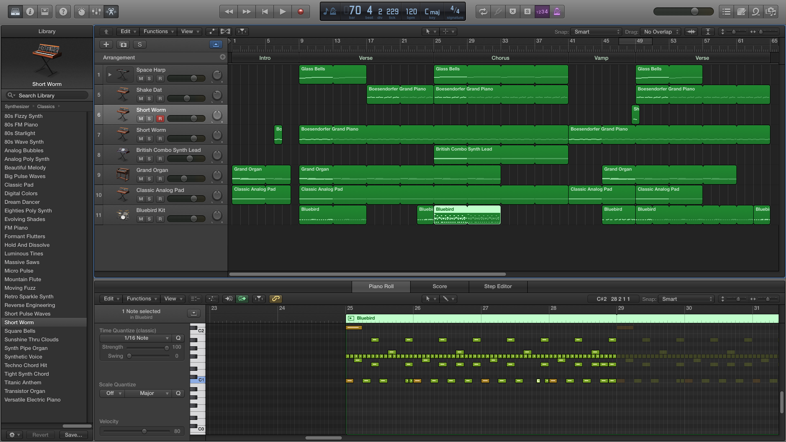

<iframe width="100%" height="166" scrolling="no" frameborder="no" src="https://w.soundcloud.com/player/?url=https%3A//api.soundcloud.com/tracks/221267599&amp;color=0066cc&amp;auto_play=false&amp;hide_related=false&amp;show_comments=true&amp;show_user=true&amp;show_reposts=false"></iframe>

### Form
Form so far for this version:  
Intro | Verse | Verse | Chorus | Chorus | Vamp | Verse | Verse

### Feel
Feel has changed slightly away from melancholic towards the happier side of things.

### Instrumentation
- Bells
- Synth
- Synth Bass
- Dirty Electric Guitar
- Organ
- Analog Pad
- Drumkit

### Screenshots

### Misc
I've chosen a title based on what the track sounds like now and what I picture when listening to it. Drums doesn't seem to be right for some reason; will have to rework it.