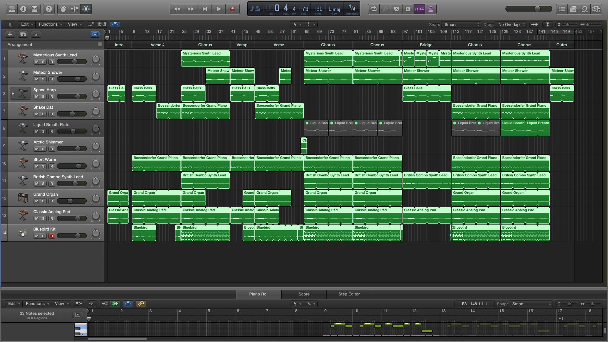

<iframe width="100%" height="166" scrolling="no" frameborder="no" src="https://w.soundcloud.com/player/?url=https%3A//api.soundcloud.com/tracks/222151719&amp;color=0066cc&amp;auto_play=false&amp;hide_related=false&amp;show_comments=true&amp;show_user=true&amp;show_reposts=false"></iframe>

## Form
Intro | Verse | Chorus | Vamp | Verse | Chorus | Chorus | Bridge | Chorus | Chorus | Ending

## Screenshot

## Misc
Reworked the drums so it doesn't sound off. Added a lead to cut through the layers for the melody during the chorus. The sound of the lead will have to be worked on though, something not quite right about it. The ending should also have been dragged on longer to allow for the instruments to fade out on its own after there are no more notes; cutting it like that now is too abrupt.