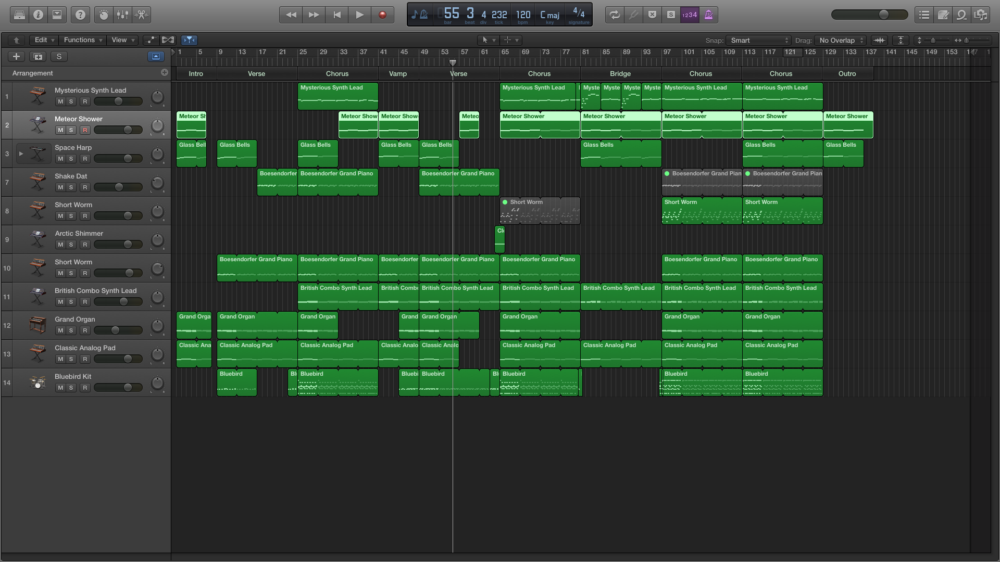

<iframe width="100%" height="166" scrolling="no" frameborder="no" src="https://w.soundcloud.com/player/?url=https%3A//api.soundcloud.com/tracks/223349586&amp;color=0066cc&amp;auto_play=false&amp;hide_related=false&amp;show_comments=true&amp;show_user=true&amp;show_reposts=false"></iframe>

## Form
Intro | Verse | Chorus | Vamp | Verse | Chorus | Bridge | Chorus | Chorus | Ending

## Screenshot

## Misc
While copying and moving sections around, apparently a section of that overdriven electric guitar found its way into the 2nd verse where it's __not__ supposed to be so please ignore that.

I've cut out one repeat of the chorus after the 2nd verse to shorten the entire track from 5:08 to 4:36 now. I managed to make Logic Pro X fade out the ending by simply extending the last section beyond its final notes. Added a new pattern and instrument to the chorus(es?) after the bridge and the hook into the last chorus in an attempt to defeat sameness/boringness. Also muted the running synth line in that area since it clashed with the new pattern; too many notes in the same frequency range.

I'm not using the built-in drummer function in Logic Pro X since I found it hard to make it do what I want it to, nor am I using Apple Loops since 1. loading the loops library takes forever and 2. I had a pretty good idea of the drum patterns I wanted and did not want to waste time looking through the loops library. The entire drums part is done by manually editing the piano roll using the drum kit instrument. I added a few more hi-hats to the verse after the vamp so that there won't be too sudden a change going from vamp to verse. Also changed the hi-hats part in the last 2 choruses to cymbals, again to defeat sameness but also to bring the song higher at its climax.

I am still dissatisfied with how the lead sounds but this is the best instrument I could find for this so far. The lead does do its job of cutting through the layers and having its presence but does not seem to do it in a way that fits the mood of the entire song. It may be perhaps because I do not really yet have a proper idea of the sound I want for lead. Some tweaking and experimenting on the instrument itself will have to be done soon. More fills or automation could be added too to make transitions less jarring. Overall, the structure and form should already be more or less finalised.

Sadly, no money for new earphones/headphones... yet.