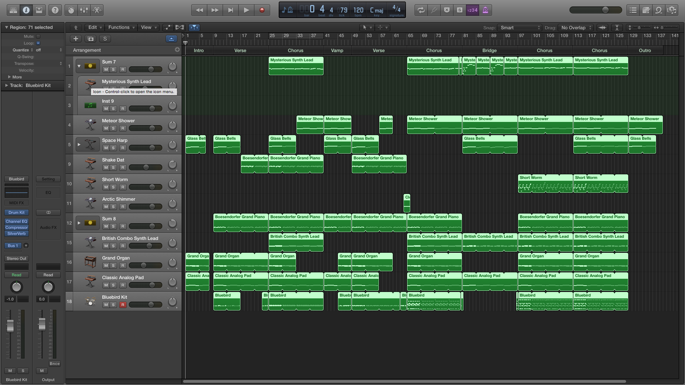

<iframe width="100%" height="166" scrolling="no" frameborder="no" src="https://w.soundcloud.com/player/?url=https%3A//api.soundcloud.com/tracks/224294161&amp;color=0066cc&amp;auto_play=false&amp;hide_related=false&amp;show_comments=true&amp;show_user=true&amp;show_reposts=false"></iframe>

[Download](http://www.mediafire.com/download/48le3u4ebc5xq49/blue-ocean-wk6.mp3)

## Screenshot

## Misc
Finally created a sound I'm okay with after much tweaking and playing around with track stacks for the melody. Also created another track stack for the bass to fatten it up. Applied the _humanize_ MIDI transform onto the drums but honestly I think my listening isn't good enough to hear the difference. Added a few effects here and there like reverb on the drums and electric guitar to make them sound more "echo-y". Also added compressors on the drums and bass to give them a bit more punch. I realised my earphones are skewed towards the trebles which is why my tracks have been sounding so bassy. Will have to borrow a better or flatter pair ASAP and equalise everything.