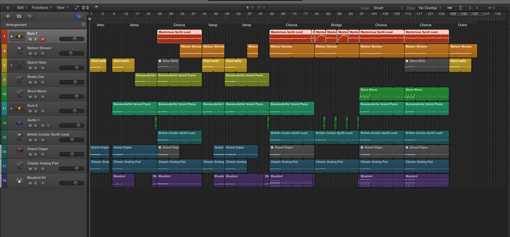

<iframe width="100%" height="166" scrolling="no" frameborder="no" src="https://w.soundcloud.com/player/?url=https%3A//api.soundcloud.com/tracks/228677159&amp;color=0066cc&amp;auto_play=false&amp;hide_related=false&amp;show_comments=true&amp;show_user=true&amp;show_reposts=false"></iframe>

## Screenshot

## Misc
This is the first mix of the track taking into account the comments others have given. Removed the organ at places where there seemed to be too many instruments especially when the lead comes in to make the pads less muddy. Also removed glass bells when the lead comes in to give the lead and meteor shower more space.

Increased time for attack for the electric guitar and enabled the limiter on its gain to make it sound less harsh yet still exciting enough since my intention for the electric guitar part is for it to sound like waves crashing on the beach. Split the kick from the drum set for EQ-ing and applied sidechain onto the bass linked to the kick to make the kick more obvious.

Added a reverse cymbal effect at certain points to make transitions a bit smoother and the bridge more interesting. Also EQ-ed and added various effects onto all the tracks.

Borrowed a better pair of headphones this time so the EQ should be better.
