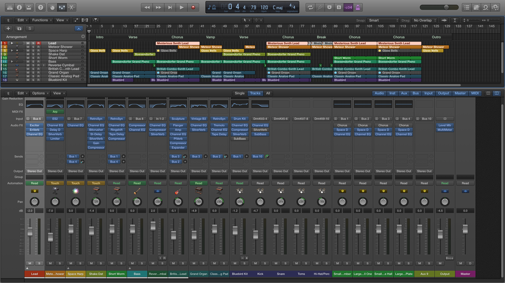

<iframe width="100%" height="166" scrolling="no" frameborder="no" src="https://w.soundcloud.com/player/?url=https%3A//api.soundcloud.com/tracks/229702519&amp;color=0066cc&amp;auto_play=false&amp;hide_related=false&amp;show_comments=true&amp;show_user=true&amp;show_reposts=false"></iframe>

## Downloads
[Blue Ocean - Mix 2](http://www.mediafire.com/download/zcaoa3fusko1z4k/blue-ocean-mix2.wav)  
[Blue Ocean - Mix 1](http://www.mediafire.com/download/cg49bu2qkucr9qf/blue-ocean-mix1.wav)

### Alternate Links
[Blue Ocean - Mix 2](https://www.dropbox.com/s/gi9idorw98nkl04/blue-ocean-mix2.wav?dl=0)  
[Blue Ocean - Mix 1](https://www.dropbox.com/s/eqjjmpdti6byrzd/blue-ocean-mix1.wav?dl=0)

## Screenshot

## Misc
For mix 2, the bridge section has been cut and is now just a break. Decreased the attack of the bass so it sounds more on-beat. Added reverb on the organ and reverse cymbal so they don't sound so in-your-face. Split the drumkit up into its components and panned each of them differently to increase the feeling of space. Panned other instruments a bit more extremely to spread everything out.

## Comparison with reference track

### Form
For the form, I kept close to the reference track's with

Intro | Verse | Chorus | Vamp | Verse | Chorus | Bridge/Break | Chorus | Chorus | Ending

### Feel
The overall feel of the song ended up a lot happier than the melancholic feel of the reference track. However, it still retains the ambient yet exciting sound of the reference track.

### Instruments
Similar instruments were used to create the signature ambient yet exciting sound with the combination of distorted electric guitar, organ and pad, and drumkit.

## Reflections
Throughout the whole process, I have learnt how to use the various features Logic Pro X offers. Things like carrying out MIDI transformations, crafting a sound and applying different effects. I've also learnt to analyse a song, how to affect the dynamics in a song, equalising and creating space.

One thing that really struck me though, that I had really thought should have been done for all music, was that all timing should be exact. During the composition phase, I was careful to always reposition the notes so they started and ended exactly on the beat. Which was why I was really surprised that Logic Pro X had the _humanize_ MIDI transform to introduce randomness into the timing and velocity of the notes.

I really enjoyed composing the drum track too. Since I don't play the drums, I went to learn a few basics of drumming from a drummer friend to come up with the rhythm. Coming up with variations to keep things exciting and transitions to make section changes smooth was especially difficult and required more than a bit of feedback.